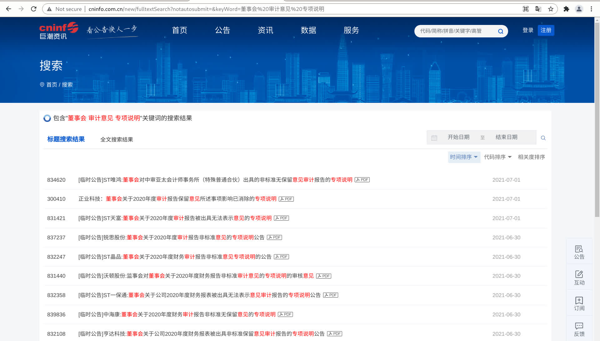

# NLP For Accounting

## 目录结构

- `firms.csv` 报告列表

- `pdf` PDF 文件目录

- `convert-pdf-to-txt' 转换 PDF 到 TXT

- `txt` TXT 文件目录，由 `convert-pdf-to-txt` 和 `pdf` 构建

## Data source

<http://www.cninfo.com.cn/>

包含"*董事会 审计意见 专项说明*"关键词的搜索结果
